# Introducción a la Inteligencia Artificial - Práctica 3: Introspección

## Actividad: Resolución al problema de alfiles

Presentado por Francisco Javier Villegas Reyes

### Planteamiento del problema

Coloca ocho alfiles (cuatro negros y cuatro blancos) en un tablero deajedrez reducido, tal como se ve en la figura. El problema consiste en hacerque los alfiles negros intercambien sus posiciones con los blancos, ningún alfildebe atacar en ningún momento otro del color opuesto. Se deben alternarlos movimientos, primero uno blanco, luego uno negro, luego uno blanco yasí sucesivamente. ¿Cuál es el mínimo número de movimientos en que sepuede conseguir?.

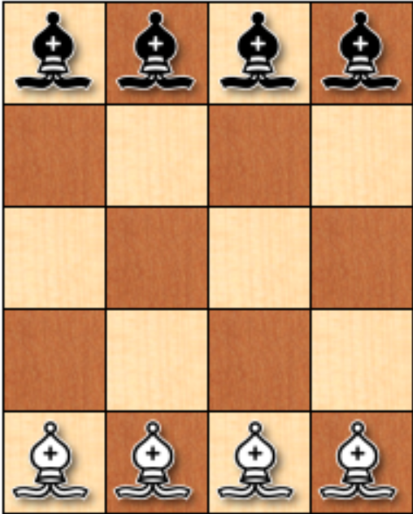

### Resolución del problema

#### Paso 1: Análisis

Para resolver este problema hay que analizar a detalle lo que se pide, además de saber qué elementos se tienen para su análisis. Para este caso en partícular, se deben de cambiar las posiciones de los alfiles, en otras palabras, los alfiles blancos deberán estar en las casillas superiores, y los alfiles negros deberán estar en las casillas inferiores, otro dato con el que se cuenta es la dimensión del tablero, la cual es de 4x5, que es en este en donde se realizarán todos los movimientos. Además de estos datos, existe una condicional que será el principal reto en este desafío, el cual es que ningún alfil deberá atacar a otro, es decir, que no se encuentre en la misma casilla con ningún otro alfil.

Dentro del planteamiento del problema no se menciona la forma en la que el alfil deberá moverse en el tablero, así que se supondrá que se deberá mover acorde a sus movimientos dentro del juego de agedrez, el cual consiste en movimientos de manera diagonal, en cualquier cantidad de casillas y hacia cualquier dirección, lo que también implica que solo podrá estar en casillas del mismo color que la casilla de origen.

Una vez definido lo anterior, podemos comenzar a definir los objetivos, además de las medidas de rendimiento con las que lo evaluaremos.

**Objetivo:** Intercambiar las posiciones de los alfiles blancos con los alfiles negros en la menor cantidad de movimientos posibles.

**Medidas de rendimiento:**

* Se ejecuta un unico movimiento por color: +1
* Ningún alfil ataca a otro: +1
* Los alfiles se atacan entre ellos: -1
* Se ejecutan movimientos consecutivos por color: -1
* Los alfiles intercambiaron posiciones: +1

#### Paso 2: Razonamiento

Para este problema, un alfil no puede llegar en un unico movimiento al otro lado del tablero, esto por 2 razones, la primera es que el tablero no es cuadrado, lo que impide que algún el alfil pueda alcanzar el otro lado del tablero de un solo movimiento, la segunda razón es que tenemos la limitación de que dos alfiles no pueden estar ocupando la misma celda al mismo tiempo, ya que esto se consideraría un ataque entre ellos. Entonces, sabiendo esto, el número mínimo de movimientos por alfil para alcanzar el otro extremo son 2, ahora, tomando en cuenta que en total tenemos 8 alfiles, podemos determinar que el número mínimo de movimientos para intercambiarlos de lugar es 16 (2 por cada alfil). Aunque esto solo es una suposición, ya que también debe de tomarse en cuenta que para que sea posible el intercambio, se debe de mover el alfil que se encuentra ocupando el lugar en el que se ubicará. Entonces se buscará un algoritmo con el cual podamos ejecutar los movimientos de la forma más optimizada.

#### Paso 3: Diseño de algoritmo

Para que el número de movimientos ejecutados sea el mínimo por alfil, es decir, 2 movimientos, es necesario que su movimiento no se interrumpa con otro alfil, además, deberán de irse turnando los movimientos, el siguiente será el proceso que se seguirá en el algoritmo.

Se iniciará para este ejemplo con el color blanco, tomando el alfil del extremo izquierdo. Este se moverá lo mas cerca del borde superior como se muestra en la imagen de abajo, con esto, se buscará que el alfil estorbe lo menos posible.

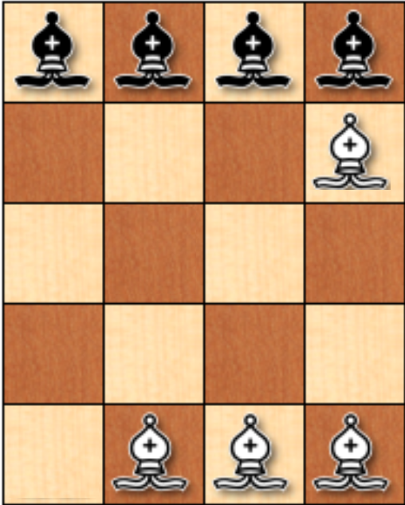

Ahora, sacamos su opuesto, pero este lo dejaremos de forma que en el siguiente movimiento se pueda incorporar a la casilla que dejó libre el alfil blanco anterior.

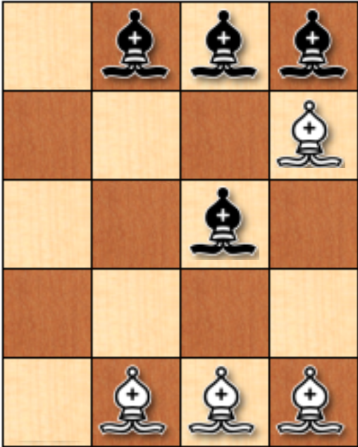

Ahora, como el siguiente turno es para el color blanco, tomaremos el alfil en la tercera posición de izquierda a derecha, y lo moveremos una casilla arriba, de forma que en el siguiente movimiento de este alfil se pueda incorporar en el espacio que dejó el primer alfil negro.

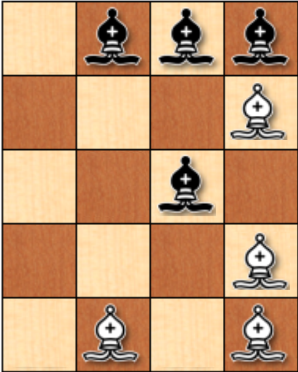

El siguiente turno es del color negro, entonces el alfil que se encuentra en el centro del tablero lo moveremos al espacio en libre que se encuentra en la posición inferior izquierda.

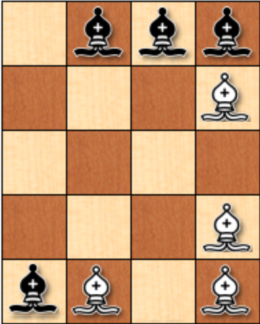

En el siguiente turno de los blancos, el alfil 3, lo moveremos al espacio vacío que se encuentra en el extremo izquierdo superior.

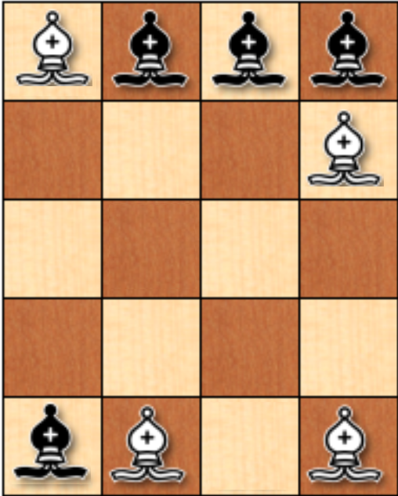

Ahora, moveremos el alfil 3 negro, de forma que en su siguiente movimiento pueda quedar en la casilla vacía que se encuentra en el borde inferior, además de que este mismo alfil, deje el espacio vacío necesario para que el alfil blanco se asimile ahí.

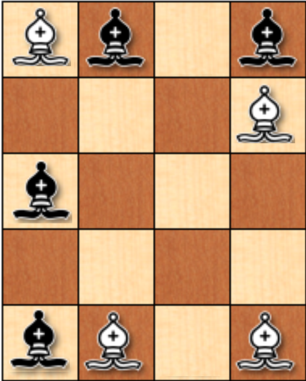

El alfil blanco ahora lo moveremos a la posición que acaba de dejar vacía el alfil negro.

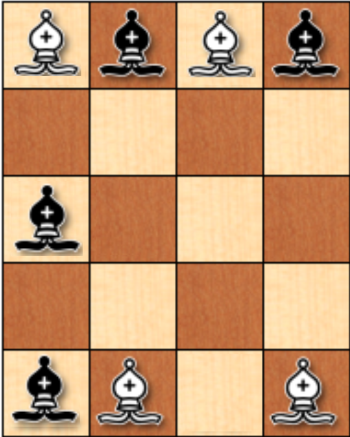

Por último el afil negro que se encuentra en el centro del tablero lo moveremos a la posición vacía de la parte inferior.

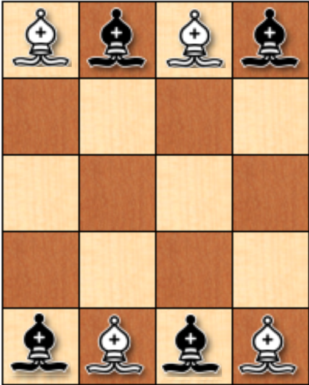

Con esto, habremos movido 4 de los alfiles en 8 movimientos, logrando el objetivo de mover a los alfiles en la menor cantidad de movimientos posibles. Ahora, este algoritmo se puede aplicar de la misma forma para los alfiles restantes. A continuación se mostrará la secuencia de percepción para mover todos los alfiles.

#### Paso 4: Secuencia de percepción

Se enumerarán los alfiles de izquierda a derecha, comenzando de 1 hasta llegar a 4. Además, se utilizará un sistema de cordenadas para ubicar la posición, el recuadro de abajo a la izquerda será el origen, por lo que empezará con (1,1).

**Primera percepción:**  Se realiza el movimiento del alfil blanco 1 hasta el fondo del tablero con un movimiento en diagonal hacia la posición (4,4).

**Segunda percepción:** El alfil negro 1 se moverá a la posición (3,3).

**Tercera percepción:** El alfil blanco 3 se moverá a la posición (4,1).

**Cuarta percepción:** El alfil negro 1 que se encuentra en la posición (3,3) se moverá a la posición (1,1).

**Quinta percepción:** El alfil blanco 3 que se encuentra en la posición (4,1) se moverá a la posición (1,5).

**Sexta percepción:** Ahora el alfil negro 3 se moverá a la posición (1,3).

**Septima percepción:** El alfil blanco 1 que se encuentra en la posición (4,4) se moverá a la posición (3,5).

**Octava percepción:** El alfil negro 3 que se encuentra en la posición (1,3) se moverá a la posición (3, 1).

**Novena percepción:** El alfil blanco 4 se moverá a la casilla (1,4).

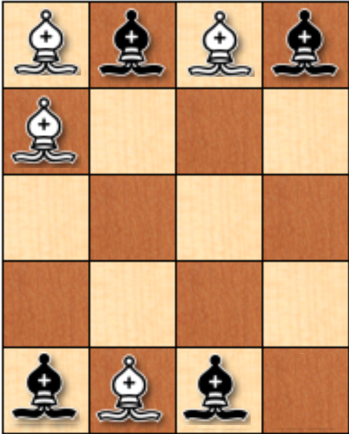

**Decima percepción:** El alfil negro 4 se moverá a la posición (2,3).

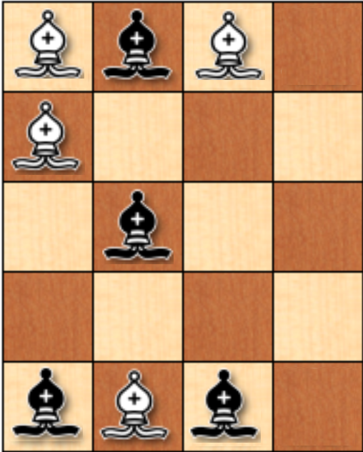

**Onceava percepción:** El alfil blanco 2 se moverá a la posición (1,2).

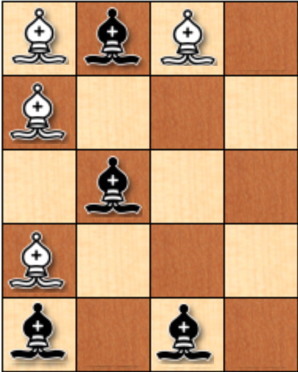

**Doceava percepción:** El alfil negro 4 que está en la posición (2,3) se moverá a la posición (4,1).

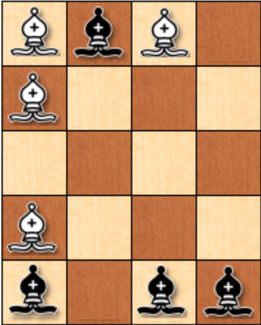

**Decimotercera percepción:** El alfil blanco 2 que se encuentra en la posición (1,2) se moverá a la posición (4,5).

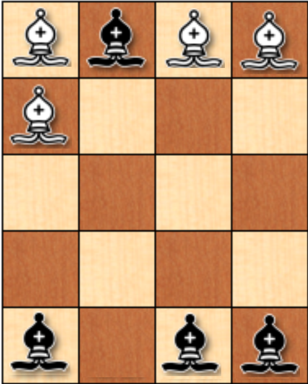

**Decimocuarta percepción:** El alfil negro 2 se moverá a la posición (4,3).

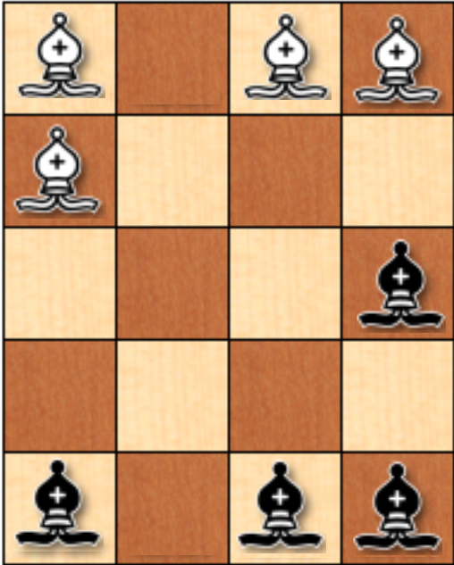

**Decimoquinta percepción:** El alfil blanco 4 que está en la posición (4,1) se moverá a la posición (2,5).

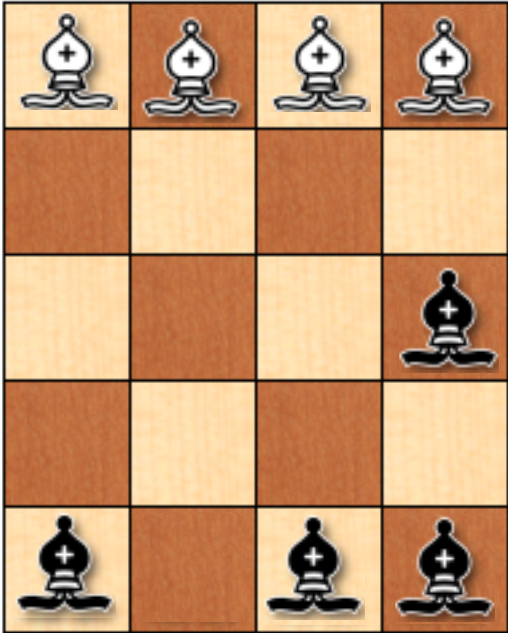

**Decimosexta percepción:** Por último, el alfil negro que se encuentra en la posición (4,3) se moverá a la posición (2,1).

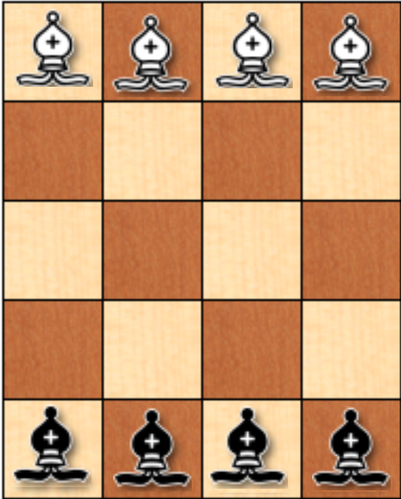

De esta manera, se han movido todos los alfiles en la menor cantidad de movimientos posibles.