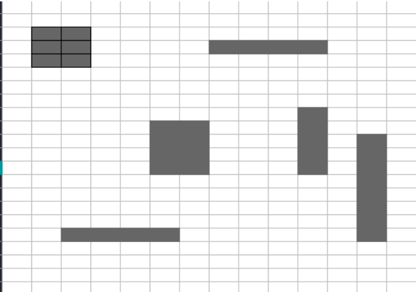
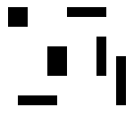

# Introducción a la Inteligencia Artificial - Práctica 4: Conteo de Islas

## Contenido
* [Ensayo sobre proceso de solución del problema](#actividad-1-ensayo-sobre-el-proceso-de-solución-del-problema)
* [Programación de la solución](#actividad-2-programación-de-la-solución)

## Actividad 1: Ensayo sobre el proceso de solución del problema

### "Exploración de Métodos para Contar Elementos por Color en Matrices 2D"

#### Presentado por Francisco Javier Villegas Reyes

La identificación y conteo de elementos con un color específico en una matriz se vuelve un desafío que requiere precisión y métodos efectivos. Este problema, aparentemente simple, encierra la complejidad de encontrar segmentos contiguos con el mismo color en una estructura bidimensional. Ante esta tarea, surge la necesidad de desarrollar algoritmos eficientes que permitan identificar y cuantificar estas secciones de forma exacta y sin ambigüedades.

La propuesta para resolver este problema implica el desarrollo de un programa capaz de detectar y contar los elementos con el mismo color en una matriz. Para comprender a cabalidad la magnitud del reto, se ha presentado un ejemplo que ilustra la matriz donde se desea realizar el conteo:



En este contexto, se plantea la necesidad de recorrer punto a punto toda la matriz, identificar áreas contiguas con el mismo color y, crucialmente, evitar la duplicidad en el conteo. Se propone una estrategia que se basa en un análisis exhaustivo de la conexión entre los puntos adyacentes, permitiendo reconocer y contabilizar secciones independientes con el mismo tono.

El enunciado del problema inicial se completa con la especificación de dos métodos distintos para resolverlo: uno iterativo y otro recursivo. El primero se enfoca en un recorrido sistemático de la matriz, analizando vecindades y registrando las áreas detectadas, mientras que el segundo plantea una estrategia recursiva para explorar las conexiones y realizar el conteo de manera más abstracta y eficiente.

Entonces, podemos definir que para este problema se buscará el numero de elementos dentro de una matriz, es decir, en dos dimensiones.

La forma en la que se propone resolver el problema consiste en recorrer toda la matriz punto a punto, de forma que cuando se detecte un nuevo color comience un proceso de busqueda de islas, donde las islas serán segmentos de la matriz que sean del mismo color, además, este proceso deberá de guardar las islas que fueros escaneadas, para evitar falsos positivos y no se tenga un conteo erroneo.

La definición de la isla se limitará solamente a aquellos puntos que estén unidos de maner vertical u horizontal, de forma que aquellas islas donde sus extremos estén unidos de forma diagonal no forman parte de una misma isla, y se tomarán como dos islas diferentes.

En las instrucciones proporcionadas para este problema se indicó que deben de generarse dos algoritmos diferentes, el primero que veremos en este ensayo será el algoritmo que resuelva el problema de forma iterativo.

**Método Iterativo**

* Se recorrera la matriz de izquierda a derecha y de arriba a abajo.
* Cuando se encuentre un elemento de un color especifico o diferente al del fondo, se compara con una lista que almacena las coordenadas que ya han sido registradas para una isla.
  * Si no ha sido registrada, entrara en el método de registro de islas.
  * Si ya fue registrada, ignorará ese pixel y continuará con el recorrido.
* Las coordenadas que entran en el método de registro de islas entrara en una pila.
* Se iniciará un ciclo que durará mientras la pila siga teniendo datos.
* Se obtendrán los datos que se encuentren en la parte superior de la pila.
* Se agregan las coordenadas a la lista.
* Se verifica que su vecino de la derecha sea de un color diferente al del fondo, ademas que se encuentre dentro de los rangos de la matriz, y que las nuevas coordenadas no estén ya en la lista, si se cumple con las condiciones se agrega a la pila.
* Se verifica que su vecino de la izquierda sea de un color diferente al del fondo, ademas que se encuentre dentro de los rangos de la matriz, y que las nuevas coordenadas no estén ya en la lista, si se cumple con las condiciones se agrega a la pila.
* Se verifica que su vecino de arriba sea de un color diferente al del fondo, ademas que se encuentre dentro de los rangos de la matriz, y que las nuevas coordenadas no estén ya en la lista, si se cumple con las condiciones se agrega a la pila.
* Se verifica que su vecino de abajo sea de un color diferente al del fondo, ademas que se encuentre dentro de los rangos de la matriz, y que las nuevas coordenadas no estén ya en la lista, si se cumple con las condiciones se agrega a la pila.
* Se verifica si la pila sigue teniendo elementos, si contienen más elementos, se repite el ciclo, en caso contrario termina el ciclo.
* Se aumenta el contador de islas encontradas.
* Se continua con el recorrido de la matriz.
* Una vez termina el recorrido de la matriz se muestran la cantidad de islas encontradas.

El segundo método por el que se pidió resolver fue el método recursivo.

**Método Recursivo**

* Se recorrera la matriz de izquierda a derecha y de arriba a abajo.
* Una vez qque se encuentre un elemento de un color específico o diferente al del fondo, se compara con una lista que almacena las coordenadas que ya han sido registradas para una isla.
  * Si no se encuentra en la lista, se manda llamar una función, la cual recibe las cordenadas del elemento encontrado.
  * Si ya se encuentra en la lista se ignora y continua el recorrido de la matriz.
* En la función se ejecuta lo siguiente:
  * Se verifica que las coordenadas no se encuentren ya en la lista.
  * Si se encuentran en la lista no hace nada y termina la función.
  * Si no se encuentran en la lista continúa.
  * Se agregan las coordenadas a la lista.
  * Se verifica que el vecino de la derecha es de un color diferente al fondo, si es diferente y las coordenadas entran en el rango de la matriz se vuelve a llamar a la función enviandole las coordenadas del vecino.
  * Se verifica que el vecino de la izquierda es de un color diferente al fondo, si es diferente y las coordenadas entran en el rango de la matriz se vuelve a llamar a la función enviandole las coordenadas del vecino.
  * Se verifica que el vecino de arriba es de un color diferente al fondo, si es diferente y las coordenadas entran en el rango de la matriz se vuelve a llamar a la función enviandole las coordenadas del vecino.
  * Se verifica que el vecino de abajo es de un color diferente al fondo, si es diferente y las coordenadas entran en el rango de la matriz se vuelve a llamar a la función enviandole las coordenadas del vecino.
* Una vez que termine la ejecución de la función se incrementa el contador de las islas.
* Se continúa el contenido de la matriz y se repite todo el proceso de arriba hasta llegar al final de la matriz.
* Se muestra la cantidad de islas encontradas.

El desafío de contar elementos con el mismo color en una matriz revela la complejidad de los algoritmos requeridos para identificar áreas contiguas de manera precisa. La resolución de este problema ha llevado al desarrollo de métodos iterativos y recursivos, cada uno con sus propias ventajas y enfoques, para abordar esta tarea de manera eficiente.

El método iterativo se destaca por su enfoque sistemático, recorriendo la matriz punto a punto y registrando áreas detectadas, lo que lo hace ideal para matrices de tamaño moderado y secuencias de colores homogéneos. Por otro lado, el método recursivo ofrece una perspectiva más abstracta y versátil al explorar las conexiones entre elementos, mostrando su eficacia en matrices complejas con múltiples tonalidades.

La elección entre estos enfoques depende en gran medida de la naturaleza específica del problema y las características de la matriz. Ambos métodos han demostrado su utilidad en la identificación precisa de áreas contiguas, contribuyendo significativamente a resolver el desafío planteado.

Este análisis detallado de los métodos iterativo y recursivo para contar elementos con el mismo color en una matriz destaca la importancia de comprender la estructura y lógica detrás de estos algoritmos. Además, resalta la necesidad de adaptar y seleccionar la estrategia más adecuada según las particularidades del problema, ofreciendo así soluciones eficientes y precisas.

El estudio de estos métodos no solo proporciona herramientas para abordar este problema específico, sino que también fomenta una comprensión más profunda de los algoritmos en entornos de estructuras de datos bidimensionales. Esta exploración refuerza la importancia de la elección y aplicación de técnicas algorítmicas específicas en la resolución de desafíos de manipulación y análisis de matrices.

En última instancia, la diversidad de enfoques y la comprensión detallada de los algoritmos proporcionan un marco sólido para la resolución efectiva de problemas similares, destacando la importancia de la eficiencia y la precisión en la manipulación de datos bidimensionales en el campo de la programación y la computación.

## Actividad 2: Programación de la solución

### Programación del método iterativo

En la siguiente sección de código se muestra el método iterativo que utiliza la lógica explicada en el ensayo.

```python
def registro_isla_iterativo(i, j):
    stack = [(i, j)]
    while stack:
        x, y = stack.pop()
        lista.add((x, y))
        for dx, dy in [(0, 1), (1, 0), (0, -1), (-1, 0)]:
            nx, ny = x + dx, y + dy
            if 0 <= nx < w and 0 <= ny < h and mascara[nx, ny] != 0 and (nx, ny) not in lista:
                stack.append((nx, ny))
```

Este segmento de código recorre la matriz, una vez encontrada una isla, de forma iterativa.

### Programación del método recursivo

En la siguiente sección de código se muestra el método recursivo que utiliza la lógica explicada en el ensayo.

```python
def registro_isla_recursiva(i, j):
    if (i, j) not in lista:
        lista.append((i, j))
        if (j+1 < h) and (mascara[i,j+1] == 255):
            registro_isla_recursiva(i, j+1)
        if (i+1 < w) and (mascara[i+1,j] == 255):
            registro_isla_recursiva(i+1, j)
```

Este forma de registrar las islas no contienen de forma explicita un ciclo, y ese es el chiste de que sea recursivo.

### Programa principal

Para la ejecución del programa se va a utilizar la siguiene imagen como ejemplo.



Primero se importan primero las librerías.

```python
import cv2 as cv
```

Como el programa se diseñó para trabajar bajo funciones, hay que declarar las funciones antes de la lógica de todo el código, a continuación se muestra la estructura de las funciones que se utilizaron.

```python
def startSearch(mascara):
    
    def registro_isla_recursiva(i, j):
        if (i, j) not in lista:
            lista.append((i, j))
            if (j+1 < h) and (mascara[i,j+1] == 255):
                regIsland(i, j+1)
            if (i+1 < w) and (mascara[i+1,j] == 255):
                regIsland(i+1, j)
    
    
    def registro_isla_iterativo(i, j):
        stack = [(i, j)]
        while stack:
            x, y = stack.pop()
            lista.add((x, y))
            for dx, dy in [(0, 1), (1, 0), (0, -1), (-1, 0)]:
                nx, ny = x + dx, y + dy
                if 0 <= nx < w and 0 <= ny < h and mascara[nx, ny] != 0 and (nx, ny) not in lista:
                    stack.append((nx, ny))
        conteoisla[0] = conteoisla[0] + 1
                        
    w, h = mascara.shape
    lista = set()
    conteoisla = [0, 0]
    for i in range(w):
        for j in range(h):
            if (mascara[i,j] != 0) and (i, j) not in lista:
                    # Se utiliza una u otra función dependendiendo si se desa el método iterativo o recursivo
                    registro_isla_iterativo(i, j)
                    registro_isla_recursiva(i, j)
                    conteoisla[1] = conteoisla[1] + 1
                
    return conteoisla
```

Ahora, hay que cargar la imagen que se va a analizar y cambiar su modelo de color para trabajar de mejor manera.

```python
img = cv.imread('D:/Imagenes/tr.png', 1)
imgRGB = cv.cvtColor(img, cv.COLOR_BGR2RGB)
imgHSV = cv.cvtColor(imgRGB, cv.COLOR_RGB2HSV)
```

Para buscar debemos definir el umbral de color, como la busqueda se realizará para la siguiente imágen, lo definiremos para un umbral del color negro.

```python
# Definición del umbral para el color negro
umbral = (0,0,0)

# Solamente toma los elementos de la imagen que esten comprendidos entre el rango de color del umbral.
mascara = cv.inRange(imgHSV, umbral, umbral)
```

Ya por último se manda llamar el método de conteo y se le pasa la máscara.

```python
conteo = startSearch(mascara)
print(f'El método iterativo encontró {conteo[0]} islas y el método recursivo encontró {conteo[1]} islas.')
```